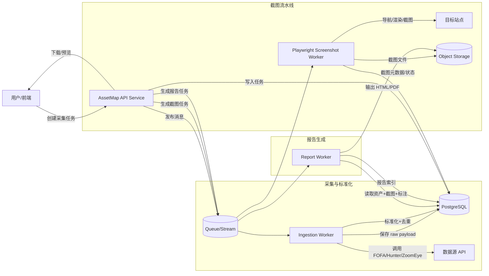

# AssetMap 项目方案文档

**Executive Summary**：AssetMap 旨在将 FOFA、鹰图（YingTu/Hunter）、ZoomEye 三个网络空间测绘数据源的资产结果进行**批量采集、去重、标准化与统一建模**，并通过 **Playwright 批量截图**与**报告生成（HTML/PDF）**形成可审计、可复现、可过滤误报的资产交付物。方案采用“采集适配器 + 标准化流水线 + 可追溯存储 + 异步队列（截图/报告）+ 前后端分离”的架构，在满足不同并发/吞吐档位（低/中/高）下，通过**配额感知与限速、幂等重试、权限与审计、日志监控与合规治理**，实现从“查询语句/任务”到“截图与报告交付”的端到端闭环。关键设计点包括：统一资产模型（分层：Host/Service/Web）、保存原始返回（Raw Payload）以支撑审计与重放、截图与报告强幂等、误报标注可回滚且报告过滤可配置、以及按数据安全/个人信息保护要求进行最小化采集与留存周期控制。citeturn19view0turn25view1turn30view3turn29view0turn31view0

## 背景、范围与关键假设

AssetMap 面向“资产暴露面梳理/风险排查/周期性报告”场景：用户输入一组查询（可按组织、域名、证书特征、组件特征等），系统对三方数据源执行批量拉取并合并，形成统一资产清单，再进行截图与报告。FOFA 的连续翻页（Search After/nextid）适合大规模实时拉取以避免深分页错位；ZoomEye v2 提供以 API-KEY 鉴权的 `/v2/search` 与 `/v2/userinfo`，返回字段可选且不同字段存在权限等级差异（专业版/商业版等）；鹰图（Hunter）存在 `openApi/search` 接口形态、分页参数与（至少在实践脚本中）“积分消耗/剩余”字段返回。citeturn19view0turn25view1turn30view2turn29view0turn28search0

本方案**不实现代码**，但给出可落地的模块划分、接口与存储设计、并发与容错、测试与验收、以及粗略排期与人力估算。

**关于用户提供的压缩包（AssetMap.zip）**：压缩包内可见 `web_screenshot_xlsx.py`、`gui.py`、测试用例与示例输出（`results/`），体现了“基于 Playwright 的批量截图 + 结果汇总”原型方向；由于未提供明确约束（业务规则/部署环境/账号体系/前端原型），本方案按“无额外约束”前提设计，并在文末列出需要用户补齐的配置与资料清单。

**吞吐/并发/预算三档建议（未指定时默认中档）**：  
低档适合小团队按需出报告；中档适合安全运营组周报/月报；高档面向企业级大规模资产监测（需要更强队列与隔离、K8s 可选）。

| 档位 | 采集规模建议 | 截图规模建议 | 参考部署形态 | 适配要点 |
|---|---|---|---|---|
| 低 | 1–5 万条/批次（以配额为主） | 200–2,000 张/批次 | 单机容器 + 单队列 | 强限速、截图幂等、HTML 报告为主 |
| 中（默认） | 5–50 万条/批次（含去重后） | 2,000–20,000 张/批次 | API 服务 + Worker 分离（2–6 个 Worker） | 引入对象存储、任务分片、失败重试与审计 |
| 高 | 50 万–数百万条/周期（按组织/业务线分区） | 2 万–20 万张/周期 | 多租户队列 + K8s/自动扩缩 | 分区限速、冷热分层存储、告警与容量治理 |

> 说明：实际规模受 FOFA/鹰图/ZoomEye 的订阅等级、积分/配额与接口权限控制影响，应以“配额感知调度”动态收敛而非固定吞吐。citeturn25view1turn30view2turn28search0turn23search11turn19view0

## 数据源 API 调研与统一资产模型

### 优先来源与可信度分层

为尽量满足“官方/原始资料（中文优先）”，数据源资料优先级如下：

1) ZoomEye：采用 entity["company","KnownSec","china cybersecurity vendor"] 团队维护的 ZoomEye-python 仓库中的《ZoomEye API v2 参考手册（api.md，含更新时间）》作为主要依据（含请求示例、参数、字段释义与权限等级）。citeturn25view1turn30view2turn30view3  
2) FOFA：采用 entity["organization","FofaInfo","fofa github org"] 组织下的官方/半官方工具文档（GoFOFA 功能手册、Awesome-FOFA 的大数据拉取方案）作为主要依据，并以社区工具说明补足“10,000 条限制/时间窗口”等行为特征。citeturn22view1turn19view0turn23search11  
3) 鹰图（Hunter）：公开可直接结构化引用的“官方 API 文档”可见度较低（部分资料可能需要登录后访问），因此以可验证的接口常量与请求/响应结构为主（Go 包文档明确 `openApi/search` URL 与请求字段结构），并结合开源实现与示例文章补足字段面。citeturn29view0turn29view1turn28search0turn29view2  

### API 对比要点（认证、速率、分页、字段与付费限制）

#### ZoomEye API v2（重点：字段权限与 pagesize 上限）

ZoomEye v2 明确使用 `API-KEY` 作为请求头鉴权；用户信息接口为 `POST /v2/userinfo`，资产搜索接口为 `POST /v2/search`，请求体使用 `qbase64`（Base64 编码查询语句）与分页参数 `page/pagesize`；其中 `pagesize` 默认 10、最大 10,000。citeturn25view1turn30view2  
返回字段可选，且存在权限等级差异：例如 `iconhash_md5` 为“专业版及以上”、`robots_md5/security_md5/body/body_hash`为“商业版及以上”等；地理字段如 `continent.name/country.name/province.name/city.name`、`update_time` 等为所有用户可用。citeturn30view2turn30view3  

#### FOFA API（重点：深分页问题与 Search After/nextid）

当需要对同一查询语句进行大规模拉取时，FOFA 推荐使用“连续翻页接口（Search After）”，以 `nextid` 代替 `page`，每次响应返回 `nextid`，下一次请求带上该值以取下一页；示例接口为 `https://fofa.info/api/v1/search/next`。citeturn19view0  
同时，FOFA 的工具文档显示单次查询 `size` 默认 100，最大 10,000（并受“deductMode/免费额度/积分”影响），并存在某些大字段组合导致的更严格上限：当查询包含 `cert` 与 `banner` 时，单页最大可能被限制为 2,000；包含 `body` 时可能被限制为 500。citeturn22view1turn23search3  
社区工具亦提到：单个查询条件可导出/返回的条目受 10,000 限制，超过部分需要通过时间条件（`after/before`）拆分窗口或消耗积分。citeturn23search11  

#### 鹰图（Hunter）OpenAPI（重点：openApi/search、分页与积分字段）

可验证的 Go 包文档给出了 `openApi/search` 的 URL 模板：`https://hunter.qianxin.com/openApi/search?api-key=%s&search=%s&page=%d&page_size=%d`，并给出了请求结构（含 `start_time/end_time/is_web/status_code` 等字段）以及响应结构（`code/msg/data`、以及 `arr` 中至少包含 `ip/port/domain`）。citeturn29view0  
实践脚本显示接口常用参数还包括 `is_web`（web/非 web/全部）、`start_time/end_time`（时间范围）、`status_code`（状态码过滤），并能在响应 `data` 中读到 `consume_quota/rest_quota` 等配额/积分信息。citeturn28search0  
另有示例文章展示：`search` 参数可用 `base64.urlsafe_b64encode` 编码，并能读取 `company/isp` 等字段。citeturn29view2  

### 必要请求示例（不含真实密钥）

> 说明：以下示例仅用于接口形态说明；实际请求应遵循各平台服务条款与授权范围，并由系统在服务端安全地注入密钥（前端不接触）。citeturn25view1turn19view0turn29view0turn31view0  

**ZoomEye：用户信息与资产搜索**

```bash
# 1) 用户信息
curl -X POST "https://api.zoomeye.org/v2/userinfo" \
  -H "API-KEY: ${ZOOMEYE_API_KEY}"

# 2) 资产搜索（qbase64 + page）
curl -L "https://api.zoomeye.org/v2/search" \
  -H "API-KEY: ${ZOOMEYE_API_KEY}" \
  -d '{
    "qbase64": "ZGV2aWNlPSJyb3V0ZXIiICYmIGNvdW50cnk9IkNOIg==",
    "page": 1,
    "pagesize": 100,
    "fields": "ip,port,service,url,domain,title,update_time,country.name,city.name"
  }'
```

接口形态、参数与字段权限来自 ZoomEye API v2 手册。citeturn25view1turn30view2turn30view3  

**FOFA：常规查询与连续翻页**

```bash
# 1) 常规查询（page/size）
curl -G "https://fofa.info/api/v1/search/all" \
  --data-urlencode "email=${FOFA_EMAIL}" \
  --data-urlencode "key=${FOFA_KEY}" \
  --data-urlencode "qbase64=${QBASE64}" \
  --data-urlencode "fields=host,ip,port,protocol,title,domain,lastupdatetime" \
  --data-urlencode "page=1" \
  --data-urlencode "size=100"

# 2) 连续翻页（Search After / nextid）
curl -G "https://fofa.info/api/v1/search/next" \
  --data-urlencode "email=${FOFA_EMAIL}" \
  --data-urlencode "key=${FOFA_KEY}" \
  --data-urlencode "qbase64=${QBASE64}" \
  --data-urlencode "size=1000" \
  --data-urlencode "next=${NEXTID}"
```

连续翻页机制与示例说明来自 Awesome-FOFA 的官方方案文档。citeturn19view0  

**鹰图（Hunter）：openApi/search**

```bash
curl -G "https://hunter.qianxin.com/openApi/search" \
  --data-urlencode "api-key=${HUNTER_API_KEY}" \
  --data-urlencode "search=${SEARCH_BASE64_URLSAFE}" \
  --data-urlencode "page=1" \
  --data-urlencode "page_size=100" \
  --data-urlencode "is_web=1" \
  --data-urlencode "start_time=2025-01-01 00:00:00" \
  --data-urlencode "end_time=2025-01-31 23:59:59" \
  --data-urlencode "status_code=200"
```

URL 模板、分页参数来自可验证的 Go 包文档；`is_web/start_time/end_time/status_code` 等参数形态在开源脚本与示例中可见。citeturn29view0turn28search0turn29view2  

### 统一资产模型（Unified Asset Model）设计

为兼容三家“返回字段差异大 + 权限分层 + 同一资产多次出现”的特点，建议采用**分层统一模型**：

- **Host**：以 IP（v4/v6）为主键，承载地理、ASN/ISP/组织、反向解析等稳定属性。
- **Service**：以 `ip + port + transport/protocol(service)` 为主键，承载 banner、产品/版本、风险标签等。
- **WebEndpoint**：以 URL（scheme://host:port/path）或等价的“host+端口+协议归一化”作为主键，承载 title、status_code、headers/body 摘要、favicon/hash、证书指纹、截图等。

该模型能够：
1) 兼容 ZoomEye 既可返回 `ip/port/service` 也可返回 `url/domain/title/update_time` 的结构。citeturn30view2turn30view3  
2) 兼容 FOFA “host/ip/port/title/header/body/lastupdatetime”等字段与按证书拓线所需字段。citeturn22view1turn23search3  
3) 兼容 Hunter “ip/port/domain/url + company/isp + quota” 等混合字段形态。citeturn29view0turn29view2turn28search0  

### 字段映射表（核心字段 → 统一模型）

> 表中 “Provider 字段” 以各家文档/开源实现中常见字段名为准；若某订阅等级无权返回，则在标准化层置空，并保留 raw payload 以便追溯。citeturn30view2turn22view1turn29view0turn23search3turn28search0  

| 统一模型字段 | 说明 | FOFA 字段示例 | 鹰图（Hunter）字段示例 | ZoomEye v2 字段 |
|---|---|---|---|---|
| host.ip | IP（v4/v6） | `ip`citeturn22view1 | `ip`citeturn29view0 | `ip`citeturn30view2 |
| service.port | 端口 | `port`citeturn22view1 | `port`citeturn29view0 | `port`citeturn30view2 |
| service.service_name | 应用协议/服务 | `protocol`（或规范化后）citeturn22view1 | `protocol`/`base_protocol`（若返回）citeturn28search0 | `service`citeturn30view2 |
| web.url | 完整 URL | `host` + `fixUrl/urlPrefix` 规范化citeturn22view1 | `url`citeturn28search0 | `url`citeturn30view2 |
| web.domain | 域名 | `domain`（如返回） | `domain`citeturn29view0 | `domain`citeturn30view2 |
| web.title | 页面标题 | `title`citeturn22view1 | `web_title`（实践字段） | `title`（list）citeturn30view2 |
| web.status_code | HTTP 状态码 | `status_code`（若返回/或二次探测） | `status_code`（参数/可能返回）citeturn28search0 | 可用二次探测或从 header 解析（建议自测）citeturn30view3 |
| web.headers_raw | HTTP 响应头 | `header`citeturn22view1 | `header`（若返回） | `header`citeturn30view3 |
| web.body_snippet/hash | 正文摘要/哈希 | `body`（受限制）citeturn22view1turn23search3 | `body`（若返回） | `body/body_hash`（商业版及以上）citeturn30view3 |
| service.banner | banner/指纹 | `banner`（受限制）citeturn23search3 | `banner`（若返回） | `banner`citeturn30view3 |
| tls.fingerprint | 证书/指纹 | `cert`、`certs_domains` 等citeturn22view1turn23search3 | `sha256`/证书字段（实践存在）citeturn28search0 | `ssl.jarm/ssl.ja3s`citeturn30view2 |
| geo.country/province/city | 地理位置 | `ip_country/ip_city` 等（视字段） | `country/province/city`（实践存在）citeturn6search1 | `country.name/province.name/city.name`citeturn30view3 |
| observed_at | 数据源探测/更新时间 | `lastupdatetime`citeturn22view1 | `updated_at`（实践字段）citeturn6search1 | `update_time`citeturn30view3 |
| source.meta | 配额/积分/计划 | `deductMode/free quota`（实践）citeturn23search11turn22view1 | `consume_quota/rest_quota`citeturn28search0 | `subscription.plan/points`citeturn25view1turn31view0 |

## 执行架构与模块划分

### 总体架构

AssetMap 建议采用“前后端分离 + 异步任务驱动”的执行架构：

- **API 服务（控制面）**：负责认证授权、任务创建、查询与过滤、误报标注、报表发起与下载权限校验。
- **采集 Worker（数据面）**：按数据源适配器执行批量抓取，进行原始落库与标准化入库。
- **截图 Worker**：从队列获取 URL，使用 Playwright 进行并发截图、失败重试与元数据采集。
- **报告 Worker**：聚合资产、过滤误报、嵌入截图，生成 HTML 与（可选）PDF，并写入对象存储。

ZoomEye v2 的字段权限与 pagesize 上限、FOFA 的 Search After/nextid、Hunter 的 openApi/search 形态决定了采集层必须内置“限速 + 配额感知 + 分页游标化 + 幂等重试”。citeturn30view2turn19view0turn29view0  

### 数据流与任务流（Mermaid）



> 说明：报告阶段必须先执行“误报过滤”与“截图就绪检查”，并对失败截图给出占位与原因，避免报告生成阻塞。FOFA 的 Search After 与 ZoomEye 的字段权限差异要求 raw payload 可追溯。citeturn19view0turn30view2turn30view3  

### 模块划分（建议代码仓库与服务边界）

- **assetmap-api**：认证授权、GraphQL/REST、查询/过滤、误报与审计、任务编排。
- **collector-adapters**：fofa/hunter/zoomeye 三个适配器（统一接口：`search(query, page_cursor, fields)`）。
- **normalizer**：统一模型映射、去重键生成、字段标准化、冲突合并策略。
- **screenshot-worker**：Playwright 截图、代理/证书策略、并发控制、重试与归档。
- **report-worker**：模板渲染、缩略图/原图链接、PDF/HTML 输出、留存治理。
- **ops**：Helm/K8s（可选）、日志/监控、CI/CD、密钥管理与合规配置。

## 数据处理与存储方案

### 存储选型：关系型为主，JSONB 保留原始返回

建议以 **PostgreSQL（关系型）**作为主存储，并在关键表中增加 `raw_payload (JSONB)` 或专门的 `source_observation` 表保存三方返回的原始结构。理由：

1) **误报标注、批量操作、回滚、审计日志**是典型强关系、强事务场景（需要一致性与可追溯变更）。  
2) 资产查询通常涉及多条件过滤（时间、标签、状态、数据源、截图状态等），关系型更易实现可控的索引策略。  
3) 各数据源返回字段差异大，用 JSONB 保留 raw payload 能保证可重放与后续扩展字段映射。  
4) 截图与报告文件不应存 DB，建议落对象存储（S3/兼容）并在 DB 存元数据与路径。

ZoomEye v2 对不同字段设置了“专业版/商业版”权限差异，因此 raw payload + 标准化字段分离尤为重要。citeturn30view2turn30view3  

### 去重与合并策略（核心）

去重应分三层：

- **Host 去重**：`ip` 归一化（IPv6 压缩形式、去掉前导 0 等），以 `ip` 为唯一键。
- **Service 去重**：`ip + port + transport/service` 组成唯一键（如 ZoomEye 的 `service`、FOFA 的 `protocol` 归一到内部枚举）。citeturn30view2turn22view1  
- **WebEndpoint 去重**：对 URL 做规范化（scheme 缺省补全、默认端口折叠、去掉尾部 `/`、Path/Query 策略可配置）。FOFA 工具支持 `fixUrl/urlPrefix` 的拼接逻辑，可作为参考实现。citeturn22view1  

冲突合并建议：  
以 `observed_at` 最新者优先；若字段为空则用旧值填补；对“title/server/header_hash/body_hash”等字段按来源可信度与权限等级加权（例如 ZoomEye `header_hash/body_hash` 可能仅在高等级可得）。citeturn30view3  

### 数据库表设计（建议）

| 表/集合 | 主键/唯一键 | 核心字段（示例） | 关键索引 | 说明 |
|---|---|---|---|---|
| hosts | `host_id (uuid)`；unique(`ip`) | `ip, rdns, asn, isp, org, geo_*` | `ip` | 对应“主机”维度，承载相对稳定属性 |
| services | `service_id`；unique(`host_id, port, service_name`) | `port, service_name, banner, product, version, device` | `(host_id,port)`、`service_name` | 对应“端口服务”维度 |
| web_endpoints | `web_id`；unique(`normalized_url_hash`) | `url, domain, title, status_code, header_hash, body_hash, tls_fingerprint` | `domain`、`status_code`、`update_time` | 对应“可访问页面/URL”维度 |
| source_observations | `obs_id`；unique(`source, source_record_id, observed_at`) | `source, query_id, observed_at, raw_payload(JSONB), quota_meta(JSONB)` | `source, observed_at` | “可追溯”关键表：保存每次抓取原始返回与配额信息 |
| asset_links | `link_id` | `host_id/service_id/web_id` | 组合索引 | 连接 Host/Service/Web，支持多对多关系 |
| screenshots | `shot_id`；unique(`web_id, shot_type, captured_at_bucket`) | `object_path, mime, width, height, sha256, captured_at, error_code` | `web_id,captured_at` | 截图文件元数据（文件在对象存储） |
| report_jobs | `report_id` | `status, params(JSONB), created_by, created_at, finished_at` | `created_at,status` | 生成任务状态与参数 |
| reports | `report_id` | `object_path_html, object_path_pdf, generated_at, scope_meta` | `generated_at` | 报告索引与下载入口 |
| labels | `label_id`；unique(`asset_type, asset_id, label_type`) | `label_type(false_positive/confirmed), reason, created_by` | `label_type` | 误报/确认标注（可配置影响报告） |
| label_audit_log | `audit_id` | `actor, action, before, after, ts, request_id` | `ts, actor` | 支撑审计与回滚 |

> 注：`captured_at_bucket` 可按“天/小时”做桶化，避免对同一资产频繁截图并利于复用报告。  

## 截图与报告生成设计

### Playwright 批量截图模块设计

Playwright 的 Page 模型允许单个 Browser 下创建多个 Page（tab），这为并发截图提供了基础；同时可以通过 context 级别配置代理与 `ignoreHTTPSErrors` 等选项。citeturn26search0turn0search3  

#### 并发控制与队列

建议采用“队列 + Worker 池”：

- 队列：`screenshot_tasks`（包含 `web_id/url/priority/retry_count/proxy_profile` 等）。
- Worker：每个 Worker 内做两级并发限制：  
  1) **全局并发**（Semaphore，例如 4/16/64 对应低/中/高档）。  
  2) **域名/网段并发**（per-domain limiter，避免对同一目标形成压测风险，也降低被封概率）。  

同时将**数据源采集与截图**解耦：采集完成即可生成截图任务；截图失败不阻断资产入库与报告（报告可使用占位图与错误原因）。  

#### 重试、超时与错误分类

- 超时：建议 navigation 超时 10–30s（按档位可配置），并设置 action 级超时（Playwright 的 actionTimeout 概念可参考）。citeturn0search6  
- 重试：对可恢复错误（DNS 临时失败、连接超时、5xx）做指数退避；对不可恢复错误（明显 4xx、证书要求人工、登录/验证码挑战）标记为“不可自动处理”并停止重试。
- 错误分类字段：`error_code`（timeout/dns/tls/auth_required/blocked/4xx/5xx/unknown），以及 `error_detail`（截断保存，避免泄露敏感信息）。

#### 代理、浏览器实例与证书问题

- 代理：按 `proxy_profile` 把任务分配至不同 context（不同出口），并在 context 配置中设置 `proxy`。citeturn0search3  
- 证书问题：对自签名/证书链异常的网站，可在 context 启用 `ignoreHTTPSErrors` 以保证截图可生成，同时在元数据记录“TLS 异常已忽略”。citeturn0search3  
- 浏览器实例管理：推荐“每个 Worker 维持 1–2 个 Browser 实例 + 多 Context 池”，避免频繁启动浏览器导致的 CPU/内存抖动；Page 用后及时关闭，防止内存泄漏。

#### JS 渲染、登录页与反爬

- JS 渲染：以 `waitUntil=networkidle`（或等价策略）等待主要资源加载，再截图；如页面持续长连接，设置最大等待时间并降级到 `domcontentloaded`。  
- 登录页：默认策略是“如遇登录页则截图登录页 + 标记 auth_required”，并允许企业内部授权场景配置“Basic Auth/预置 Cookie/SSO 跳转白名单”。（仅用于授权访问，不建议绕过站点保护。）  
- 反爬/验证码：检测到挑战页（关键词/DOM 特征）后直接标记 `blocked` 并停止自动重试，避免形成对目标的非授权对抗行为；必要时由用户在合规前提下手工处理（例如将该域名排除、或提供合法的访问方式）。  

### 截图格式与存储路径规范

建议统一格式：

- 原图：`png`（无损，利于留痕）；可选 `jpeg`（节省体积，适合高档海量截图）  
- 缩略图：`webp` 或 `jpeg`（在前端列表加载更快）  
- 命名：`{source_scope}/{yyyy}/{mm}/{dd}/{web_id}/{shot_id}_{viewport}_{status}.png`  
- 版本：同一 `web_id` 按 `captured_at` 分桶，保留最近 N 份（例如 N=3），老版本进入冷存储或清理。

### 报告生成（HTML/PDF）方案

建议先生成 HTML（可交互/可检索/易调模板），再按需转换 PDF：

- HTML：模板引擎渲染（资产分组、缩略图、点击打开原图、元数据与时间戳）。  
- PDF：两种路线  
  1) 使用 Playwright/Chromium 的 print-to-PDF 能力生成（更接近浏览器渲染）。citeturn26search11  
  2) 使用 WeasyPrint 将 HTML/CSS 渲染为 PDF（适合后端批生成）。citeturn26search5  

> 选择建议：中低档优先 WeasyPrint（依赖更纯后端）；高档若需要更高还原度/复杂前端样式，可采用 Chromium 打印为 PDF，但需关注资源消耗。citeturn26search11turn26search5  

### 报告模板字段与生成流程

| 模板区域 | 字段 | 说明 |
|---|---|---|
| 报告头 | `report_id / project_name / generated_at / creator` | 基本信息与时间戳 |
| 数据范围 | `sources_enabled / query_set / time_window` | 本次报告的查询与时间范围 |
| 汇总指标 | `total_hosts/services/web_endpoints / screenshots_ok/failed / false_positive_excluded` | 关键 KPI（含误报剔除数量） |
| 分组目录 | `group_by`（org/domain/ip_range/tag） | 支持按资产分组 |
| 资产条目 | `ip / port / url / title / geo / product/version / observed_at` | 统一资产字段展示 |
| 截图 | `thumbnail_url / full_image_url / captured_at / shot_status` | 缩略图 + 原图链接 |
| 备注与标注 | `label(false_positive/confirmed) / reason / auditor` | 误报/确认信息与审计主体 |
| 附录 | `raw_source_refs`（可选） | 可选：原始记录引用（不直接暴露敏感字段） |

**生成流程（逻辑）**：  
读取“报告范围参数” → 拉取符合条件的资产 → 应用“误报过滤规则” → 检查截图是否齐全（缺失则补拍或占位） → 渲染 HTML → 输出 PDF（可选） → 写入对象存储 → 写入报告索引与审计记录。

## 前后端分离设计：API 端点与前端页面结构

### API 风格选择：REST 为主，GraphQL 用于复杂聚合查询（可选）

- REST：更适合任务编排（创建/运行/取消）、文件下载、批量标注等操作型接口。
- GraphQL：更适合仪表盘汇总与多维筛选（减少前端多次请求），但需控制复杂度与授权边界。

### REST/GraphQL 端点设计（示例）

| 类型 | 方法 & 路径 | 目的 | 关键参数 | 返回示例（简化） |
|---|---|---|---|---|
| Auth | `POST /api/v1/auth/login` | 登录换取 token | `username,password` | `{access_token,refresh_token}` |
| 任务 | `POST /api/v1/jobs/collect` | 创建采集任务 | `sources[], queries[], fields_profile, time_window` | `{job_id,status}` |
| 任务 | `GET /api/v1/jobs/{id}` | 查看进度 |  | `{status,metrics,errors[]}` |
| 资产 | `GET /api/v1/assets` | 列表/筛选/分页 | `q,filters,page,size,sort` | `{items:[...],page,total}` |
| 资产 | `GET /api/v1/assets/{id}` | 详情 |  | `{asset,observations,screenshots,labels}` |
| 标注 | `POST /api/v1/labels/batch` | 批量误报/确认 | `asset_ids[],label_type,reason` | `{task_id,applied_count}` |
| 标注 | `POST /api/v1/labels/{audit_id}/rollback` | 回滚一次批处理 |  | `{rolled_back:true}` |
| 截图 | `POST /api/v1/screenshots/batch` | 批量触发截图 | `web_ids[],priority` | `{task_id,queued}` |
| 报告 | `POST /api/v1/reports` | 生成报告 | `scope,group_by,exclude_false_positive` | `{report_id,status}` |
| 报告 | `GET /api/v1/reports/{id}/download` | 下载 HTML/PDF | `format=html|pdf` | 文件流/签名 URL |
| GraphQL（可选） | `POST /graphql` | 仪表盘聚合 | `query` | `{data:{kpis,...}}` |

> 约束：下载类接口应按“短期签名 URL + 权限校验 + 审计记录”实现，避免对象存储裸暴露。

### 前端页面结构（建议信息架构）

- **仪表盘**：今日/本周采集任务状态、资产总量趋势、截图成功率、误报占比、来源配额（读取 `subscription/points/rest_quota` 等）。citeturn25view1turn28search0turn31view0  
- **资产列表**：多选、筛选（来源/标签/状态码/时间/地理/产品）、列自定义（显示/隐藏）、导出。
- **资产详情**：统一字段 + 原始记录（按来源分 Tab）+ 截图时间线 + 标注与审计。
- **误报标注界面**：对选中资产做“误报/已确认”批量操作，展示影响（将从报告剔除的数量），支持撤销/回滚。
- **选择列表功能（Saved Selection）**：用户可保存筛选条件或静态选择集，用于后续截图/报告复用。

## 误报管理与列表选择

### 误报管理（False Positive Management）

误报管理的目标是：用户可标注资产为“误报”或“已确认”，并可配置这些资产**不写入报告**；同时必须具备权限控制、审计与回滚。

#### 权限与审计流程

建议 RBAC 角色：

- Viewer：只读
- Analyst：可创建任务、查看资产、发起截图/报告
- Auditor：可执行误报/确认标注与回滚
- Admin：配置密钥/源账号/保留策略/系统参数

审计日志必须记录：操作者、时间、影响对象集合、变更前后、请求来源（IP/UA）、以及关联的报告 ID（若标注影响已生成报告则记录“变更后再生成”策略）。OWASP 提倡将安全事件日志与业务/审计日志分离，并保证审计轨迹的完整性与抗篡改能力。citeturn27search3turn27search11  

#### 批量操作与回滚机制（推荐实现方式）

- 批量标注：写入 `label_audit_log`（含 before/after）与 `labels` 表（幂等 upsert）。
- 回滚：以 `audit_id` 为单位，将该批次对 `labels` 的写入反向应用（删除或恢复旧标签）。
- 报告过滤：报告生成时读取“最终标签视图”（例如 `labels_effective_view`），将 `false_positive` 排除；并在报告汇总中写明“剔除数量与剔除规则版本”。

### 列表选择（Multi-select / Filter / Export / Batch Ops）

前端交互建议：

- 列表页支持：
  - 复选框多选（跨页选择可用“选择全部符合条件的 N 条”模式）
  - 筛选器（来源/时间/状态码/地理/组件/标签）
  - 批量动作：`标注误报`、`标注已确认`、`触发截图`、`加入选择列表`、`导出`
- 导出策略：
  - 小规模（≤10k）：同步导出
  - 大规模：创建“导出任务”，后台生成文件后提供下载（避免 API 超时）

后端接口要点：

- 对“跨页全选”必须使用**服务器端筛选条件**作为选择依据，而非前端传递海量 ID；同时在导出任务中记录 `filters_snapshot` 以保证可复现。

## 并发、容错、安全合规、部署运维、测试与验收

### 并发与容错策略

#### 数据源采集

- **限速**：对每个数据源配置 token bucket（请求/秒），并对 429/限流错误做退避。GoFOFA 工具参数显示其默认查询速率为 2 次/秒，可作为 FOFA 侧保守限速起点（以避免触发平台限制）。citeturn23search3turn22view1  
- **配额感知调度**：  
  - ZoomEye：从 `/v2/userinfo` 的 `subscription.points/zoomeye_points` 读取剩余额度并动态降载。citeturn25view1turn31view0  
  - Hunter：从响应字段 `consume_quota/rest_quota`（如可获得）估算剩余并降载。citeturn28search0  
  - FOFA：根据“10,000 条限制、deductMode/积分”策略决定是否拆分 `after/before` 时间窗或启用 `search/next`。citeturn23search11turn19view0turn23search3  

#### 截图与报告

- 截图队列采用 at-least-once 投递：Worker 必须幂等（同一 `web_id + captured_at_bucket` 已完成则跳过）。
- 报告生成同样幂等：同一 `report_params_hash` 已生成则直接返回现有产物（除非用户要求“强制重生成”）。

### 安全要点：API Key 管理、敏感数据加密、SSRF 防护

1) **API Key 管理**：  
   - Key 仅存服务端（Vault/KMS/密钥管理服务），前端永不下发。  
   - 支持轮换：ZoomEye APIKEY 可在个人信息中重置且不应过期；系统需支持在线切换与灰度验证。citeturn31view0turn25view1  
   - 禁止在日志中输出完整 key（仅输出 hash/尾号）。

2) **敏感数据加密**：  
   - 传输：全链路 TLS（API、对象存储、数据库连接）。  
   - 存储：对“账号凭证/代理凭证/可能的登录 Cookie”做应用层加密（信封加密），并实现最小化留存与过期清理。  

3) **SSRF/网络出站控制（截图模块尤其关键）**：  
   - 截图 Worker 运行在受控网络：默认禁止访问内网/云厂商元数据地址（除非用户明确授权并配置 allowlist）。  
   - DNS Rebinding 防护：解析后校验 IP 是否落在禁用网段。  
   - 请求头净化：禁止携带内部 Token 等敏感头。

### 合规要点：爬取目标合法性与数据保护义务

AssetMap 涉及“互联网资产信息收集、存储、加工、传输”等处理活动，应纳入数据安全治理范围。citeturn27search1  
若采集结果包含个人信息（如手机号、邮箱、个人姓名等，可能出现在 banner/网页内容中），应遵循个人信息处理的合法、正当、必要原则，并采取必要措施保障安全。citeturn27search2  

建议在产品层面固化三条合规控制：

- **授权与证据**：对每次采集任务记录授权依据（项目编号/授权函摘要/范围），并在报告中体现“范围声明”。  
- **最小化与脱敏**：默认不存储长文本 `body`，仅保存哈希/摘要；对邮箱/手机号等做脱敏展示（仅可由高权限角色查看原文或通过审计流程解锁）。  
- **留存策略**：按数据类型设置保留期（例如 raw payload 30–90 天、截图 90–180 天、审计日志 ≥ 180 天）；到期自动清理并可导出归档。

### 日志与监控

- 日志分层：API 访问日志、审计日志、任务执行日志、截图失败样本（受控保存）分开存储。OWASP 建议将审计/交易日志与安全事件日志区别对待，并确保关键操作有完整审计轨迹与防篡改措施。citeturn27search3turn27search11  
- 指标：采集成功率、429/5xx 比例、队列堆积长度、截图成功率、平均导航耗时、报告生成耗时、对象存储增长率、数据库慢查询。  
- 告警：配额耗尽、连续失败阈值、截图失败激增、导出任务超时、磁盘/对象存储逼近阈值。

### 部署拓扑与运维建议（容器化，K8s 可选）

- 低/中档：Docker Compose 或轻量容器平台即可（API、DB、Redis/RabbitMQ、对象存储、Worker 若干）。  
- 高档：引入 Kubernetes（多副本 API、HPA 自动扩缩 Worker，NetworkPolicy 控制截图出站，CronJob 做清理与归档）。  
- 对象存储：优先 S3 兼容（云对象存储或自建 MinIO），提供签名 URL 下载。  
- CI/CD：至少包括单元测试、依赖安全扫描、镜像构建、secret 扫描、自动部署到测试环境、以及一键回滚。

### 测试计划与验收标准

| 测试层级 | 覆盖内容 | 关键用例 | 验收标准（示例） |
|---|---|---|---|
| 单元测试 | 标准化映射、去重键、过滤逻辑 | 字段缺失/权限不足/非法值 | 映射正确率 ≥ 99%（以黄金样本集） |
| 集成测试 | 三方适配器（mock）+ 入库 | 分页/nextid/限流重试 | 429 退避有效；任务可恢复不中断 |
| 截图测试 | Playwright 导航/证书/超时 | 自签名证书、重定向、长加载 | 成功率目标：低档≥90%，中档≥95%，高档≥97%（在相同样本集）citeturn0search3turn0search6turn26search0 |
| 报告测试 | HTML/PDF 生成 | 图像嵌入、目录分组、占位 | 同一参数重复生成输出一致（hash/内容一致） |
| 权限与审计 | RBAC、批量标注回滚 | 越权访问、回滚一致性 | 所有标注可追溯；回滚后报告剔除规则一致 |
| 性能压测 | 队列堆积与吞吐 | 1 万/10 万/100 万资产 | 队列不失控；P95 API < 300ms（查询类） |

### 时间与人力估算（粗略）

以“中档”目标（前后端分离、三源采集、截图与报告、误报与审计、基础监控）估算：

- **人力**：  
  - 后端/数据：2 人（适配器、标准化、DB、任务系统）  
  - 截图/报告：1 人（Playwright Worker、报告模板、PDF 输出）  
  - 前端：1 人（仪表盘/列表/详情/标注/导出）  
  - 测试/运维：0.5–1 人（CI/CD、监控、压测与验收）  
  合计：约 4.5–5 人月起步（MVP），完整中档约 8–10 人月。

- **工期**：8–10 周（含测试与验收），高档（K8s、多租户、容量治理）通常需 12–16 周。

### 里程碑式实施计划（按周）

| 周期 | 交付物 | 关键内容 |
|---|---|---|
| 第一阶段 | 架构与数据模型冻结 | 统一资产模型、去重策略、DB schema、队列选型、权限模型 |
| 第二阶段 | 三源适配器 MVP | FOFA/Hunter/ZoomEye 基础查询、分页、raw 入库、标准化入库 |
| 第三阶段 | 任务系统与可观测性 | 任务状态机、限速/退避、结构化日志、基础指标 |
| 第四阶段 | 截图 Worker MVP | Playwright 并发、超时、重试、对象存储落地、截图元数据 |
| 第五阶段 | 报告生成 MVP | HTML 模板、分组目录、缩略图与原图链接、导出与下载 |
| 第六阶段 | 前端 MVP | 仪表盘、资产列表/详情、多选与筛选、截图查看 |
| 第七阶段 | 误报与审计闭环 | 标注/批量/回滚、报告过滤配置、审计日志与权限细化 |
| 第八阶段 | 联调与验收 | 压测、故障演练、文档与交付、上线切换与回滚预案 |

> 注：如需高档（K8s/多租户/大规模），建议在第六阶段后追加“性能与容量治理”专项迭代。

### 风险评估与缓解策略

1) **数据源接口变化/文档不可见**：FOFA/鹰图部分官方页面可能动态加载或登录可见，存在字段/限制变更风险；缓解：抽象适配器、保留 raw、增加契约测试与灰度。citeturn19view0turn29view0  
2) **配额耗尽与成本不可控**：ZoomEye/鹰图积分、FOFA 10,000 限制与字段限制可能导致任务失败或成本激增；缓解：配额感知调度、拆分时间窗、字段降级与缓存复用（ZoomEye-python 提供缓存思路）。citeturn31view0turn23search11turn30view3turn28search0  
3) **截图不稳定**：JS 重页面、登录/验证码、证书异常导致失败；缓解：错误分类、占位、人工白名单、`ignoreHTTPSErrors` 可控启用。citeturn0search3turn0search6turn26search0  
4) **合规与法律风险**：未授权扫描/采集与个人信息处理风险；缓解：授权流程固化、最小化采集、脱敏与留存策略、审计可追溯。citeturn27search1turn27search2  
5) **数据质量（误报/重复/冲突）**：多源合并易出现冲突；缓解：分层去重、来源置信度、人工标注回流、报告过滤闭环。citeturn22view1turn30view2turn29view0  

## 需要用户补齐的文件与配置清单

为将本方案落地为可实施项目计划与验收范围，建议用户提供或确认以下资料（若无则按默认值实施）：

| 类别 | 需要项 | 用途 |
|---|---|---|
| 账号与授权 | FOFA/鹰图/ZoomEye 的订阅等级、API Key、可用字段权限 | 决定 fields_profile、成本与限速策略 |
| 合规材料 | 授权范围（域名/IP/组织）、报告使用对象、留存要求 | 决定抓取范围与数据留存策略 |
| 部署环境 | 云/内网、是否允许访问内网资产、是否需要 K8s | 决定网络策略与拓扑 |
| 前端规范 | UI 风格、权限角色、是否对接 SSO | 决定鉴权与页面结构 |
| 报告模板 | 需要的分组维度、页眉页脚、字段清单 | 决定模板字段与渲染策略 |
| 代理与出口 | 是否需要固定出口 IP、代理池来源 | 决定 screenshot proxy_profile 与限速 |
| 压缩包现状 | AssetMap.zip 中现有脚本的期望保留/重构边界 | 决定是否延续 Python Playwright 原型或重写为服务化 Worker |

> 默认假设：不接入企业 SSO；只做基于账号/角色的登录；对象存储可用 S3 兼容；数据库用 PostgreSQL；队列用 Redis/RabbitMQ 任选其一（按团队技术栈）。