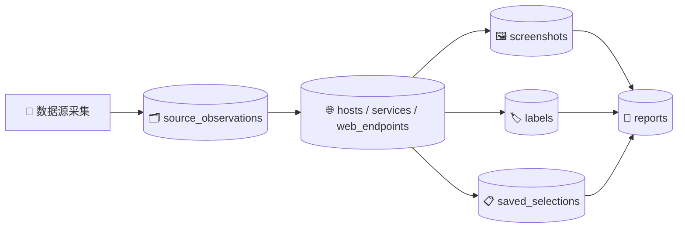

# 📋 AssetMap 数据库与 API 设计

- 📊 报告类型：技术方案
- 🏷️ 分类标签：AssetMap 数据库设计 API 设计
- 🔴 优先级：P1
- 👤 作者：Claude
- 🕐 日期：2026-04-12
- 📌 状态：✅ 已完成
- 📝 版本：v1.0

## 📊 摘要

本设计文档用于定义 AssetMap 的数据库结构和接口清单，支撑资产采集、标准化、截图、标签、选择集和报告生成等核心能力。数据库设计以 PostgreSQL 为主，强调可追溯、可筛选、可审计和可扩展；接口设计以 REST 为主，覆盖认证、任务、资产、截图、标签、选择集、报告和系统配置。整体目标是为后续开发提供清晰稳定的后端实现边界。

---

## 🔄 1. 数据流概览



---

## 📂 2. 数据库表结构设计

### 2.1 `collect_jobs`

采集任务表。

| 字段名 | 类型 | 说明 |
|---|---|---|
| id | uuid | 主键 |
| job_name | varchar(128) | 任务名称 |
| sources | jsonb | 数据源列表 |
| query_payload | jsonb | 查询参数 |
| status | varchar(32) | pending / running / success / failed |
| created_by | varchar(64) | 创建人 |
| created_at | timestamp | 创建时间 |
| started_at | timestamp | 开始时间 |
| finished_at | timestamp | 完成时间 |
| error_message | text | 错误信息 |

### 2.2 `source_observations`

原始观测表。

| 字段名 | 类型 | 说明 |
|---|---|---|
| id | uuid | 主键 |
| collect_job_id | uuid | 关联采集任务 |
| source_name | varchar(32) | fofa / hunter / zoomeye |
| source_record_id | varchar(128) | 平台原始记录 ID |
| observed_at | timestamp | 原始数据时间 |
| raw_payload | jsonb | 原始响应内容 |
| quota_meta | jsonb | 配额相关信息 |
| created_at | timestamp | 入库时间 |

### 2.3 `hosts`

主机表。

| 字段名 | 类型 | 说明 |
|---|---|---|
| id | uuid | 主键 |
| ip | varchar(64) | IP 地址 |
| rdns | varchar(255) | 反向解析 |
| asn | varchar(64) | ASN |
| isp | varchar(128) | ISP |
| org_name | varchar(255) | 组织信息 |
| country | varchar(64) | 国家 |
| province | varchar(64) | 省份 |
| city | varchar(64) | 城市 |
| first_seen_at | timestamp | 首次发现时间 |
| last_seen_at | timestamp | 最近发现时间 |

> 📌 重要：建议唯一索引为 `unique(ip)`。

### 2.4 `services`

服务表。

| 字段名 | 类型 | 说明 |
|---|---|---|
| id | uuid | 主键 |
| host_id | uuid | 关联主机 |
| port | int | 端口 |
| protocol | varchar(32) | 协议 |
| service_name | varchar(64) | 服务名 |
| banner | text | banner 信息 |
| product | varchar(128) | 产品名 |
| version | varchar(128) | 版本 |
| first_seen_at | timestamp | 首次发现时间 |
| last_seen_at | timestamp | 最近发现时间 |

> 📌 重要：建议唯一索引为 `unique(host_id, port, service_name)`。

### 2.5 `web_endpoints`

Web 资产表。

| 字段名 | 类型 | 说明 |
|---|---|---|
| id | uuid | 主键 |
| host_id | uuid | 关联主机 |
| service_id | uuid | 关联服务 |
| normalized_url | text | 规范化 URL |
| normalized_url_hash | varchar(64) | URL 哈希 |
| domain | varchar(255) | 域名 |
| title | varchar(512) | 网页标题 |
| status_code | int | HTTP 状态码 |
| scheme | varchar(16) | http / https |
| screenshot_status | varchar(32) | none / pending / success / failed |
| label_status | varchar(32) | none / false_positive / confirmed |
| first_seen_at | timestamp | 首次发现 |
| last_seen_at | timestamp | 最近发现 |

> 📌 重要：建议唯一索引为 `unique(normalized_url_hash)`。

### 2.6 `screenshots`

截图表。

| 字段名 | 类型 | 说明 |
|---|---|---|
| id | uuid | 主键 |
| web_endpoint_id | uuid | 关联 Web 资产 |
| file_name | varchar(255) | 文件名 |
| object_path | text | 对象存储路径 |
| file_sha256 | varchar(64) | 文件哈希 |
| width | int | 宽度 |
| height | int | 高度 |
| mime_type | varchar(64) | 类型 |
| captured_at | timestamp | 截图时间 |
| status | varchar(32) | success / failed / skipped |
| error_code | varchar(64) | 错误类型 |
| error_detail | text | 错误详情 |

### 2.7 `reports`

报告表。

| 字段名 | 类型 | 说明 |
|---|---|---|
| id | uuid | 主键 |
| report_name | varchar(255) | 报告名称 |
| report_type | varchar(32) | html / pdf |
| scope_type | varchar(32) | filter / selection / manual |
| scope_payload | jsonb | 范围定义 |
| object_path | text | 报告存储路径 |
| total_assets | int | 报告资产总数 |
| excluded_assets | int | 被过滤数量 |
| created_by | varchar(64) | 创建人 |
| created_at | timestamp | 创建时间 |
| finished_at | timestamp | 完成时间 |
| status | varchar(32) | pending / running / success / failed |

### 2.8 `labels`

标签表。

| 字段名 | 类型 | 说明 |
|---|---|---|
| id | uuid | 主键 |
| asset_type | varchar(32) | web_endpoint |
| asset_id | uuid | 资产 ID |
| label_type | varchar(32) | false_positive / confirmed |
| reason | text | 标记原因 |
| active | boolean | 是否生效 |
| created_by | varchar(64) | 创建人 |
| created_at | timestamp | 创建时间 |
| updated_at | timestamp | 更新时间 |

### 2.9 `label_audit_logs`

标签审计表。

| 字段名 | 类型 | 说明 |
|---|---|---|
| id | uuid | 主键 |
| batch_id | varchar(64) | 批次号 |
| asset_type | varchar(32) | 资产类型 |
| asset_id | uuid | 资产 ID |
| before_label | jsonb | 修改前 |
| after_label | jsonb | 修改后 |
| action_type | varchar(32) | create / update / rollback |
| operator | varchar(64) | 操作人 |
| operated_at | timestamp | 操作时间 |

### 2.10 `saved_selections`

保存选择集表。

| 字段名 | 类型 | 说明 |
|---|---|---|
| id | uuid | 主键 |
| selection_name | varchar(128) | 选择集名称 |
| selection_type | varchar(32) | dynamic_filter / static_ids |
| filter_snapshot | jsonb | 筛选条件快照 |
| created_by | varchar(64) | 创建人 |
| created_at | timestamp | 创建时间 |
| updated_at | timestamp | 更新时间 |

### 2.11 `selection_items`

选择集明细表。

| 字段名 | 类型 | 说明 |
|---|---|---|
| id | uuid | 主键 |
| selection_id | uuid | 关联选择集 |
| asset_type | varchar(32) | 资产类型 |
| asset_id | uuid | 资产 ID |
| created_at | timestamp | 创建时间 |

### 2.12 `users`

用户表。

| 字段名 | 类型 | 说明 |
|---|---|---|
| id | uuid | 主键 |
| username | varchar(64) | 用户名 |
| password_hash | varchar(255) | 密码哈希 |
| role | varchar(32) | viewer / analyst / auditor / admin |
| status | varchar(32) | active / disabled |
| created_at | timestamp | 创建时间 |
| updated_at | timestamp | 更新时间 |

---

## 🛠️ 3. API 设计清单

### 3.1 认证接口

#### 3.1.1 登录
**POST** `/api/v1/auth/login`

请求示例：
```json
{
  "username": "admin",
  "password": "******"
}
```

返回示例：
```json
{
  "access_token": "xxx",
  "refresh_token": "xxx",
  "user": {
    "username": "admin",
    "role": "admin"
  }
}
```

### 3.2 采集任务接口

#### 3.2.1 创建采集任务
**POST** `/api/v1/jobs/collect`

请求示例：
```json
{
  "job_name": "4月互联网资产采集",
  "sources": ["fofa", "hunter", "zoomeye"],
  "queries": [
    {
      "source": "fofa",
      "query": "domain=\"example.com\""
    },
    {
      "source": "hunter",
      "query": "domain=\"example.com\""
    }
  ],
  "time_window": {
    "start": "2026-04-01 00:00:00",
    "end": "2026-04-12 23:59:59"
  }
}
```

返回示例：
```json
{
  "job_id": "uuid",
  "status": "pending"
}
```

#### 3.2.2 查询采集任务详情
**GET** `/api/v1/jobs/{jobId}`

#### 3.2.3 获取采集任务列表
**GET** `/api/v1/jobs`

### 3.3 资产接口

#### 3.3.1 资产列表
**GET** `/api/v1/assets`

常见查询参数：
- `q`
- `source`
- `label_status`
- `screenshot_status`
- `domain`
- `status_code`
- `page`
- `size`

#### 3.3.2 资产详情
**GET** `/api/v1/assets/{assetId}`

### 3.4 截图接口

#### 3.4.1 批量截图
**POST** `/api/v1/screenshots/batch`

请求示例：
```json
{
  "asset_ids": ["uuid1", "uuid2", "uuid3"],
  "skip_existing": true,
  "priority": "normal"
}
```

#### 3.4.2 按选择集截图
**POST** `/api/v1/screenshots/by-selection`

### 3.5 标签接口

#### 3.5.1 批量标记误报 / 已确认
**POST** `/api/v1/labels/batch`

请求示例：
```json
{
  "asset_ids": ["uuid1", "uuid2"],
  "label_type": "false_positive",
  "reason": "误报站点"
}
```

#### 3.5.2 回滚标签
**POST** `/api/v1/labels/rollback/{batchId}`

### 3.6 选择集接口

#### 3.6.1 创建选择集
**POST** `/api/v1/selections`

请求示例：
```json
{
  "selection_name": "高价值资产",
  "selection_type": "dynamic_filter",
  "filter_snapshot": {
    "domain": "example.com",
    "status_code": 200
  }
}
```

#### 3.6.2 获取选择集列表
**GET** `/api/v1/selections`

#### 3.6.3 获取选择集详情
**GET** `/api/v1/selections/{selectionId}`

#### 3.6.4 删除选择集
**DELETE** `/api/v1/selections/{selectionId}`

### 3.7 报告接口

#### 3.7.1 创建报告
**POST** `/api/v1/reports`

请求示例：
```json
{
  "report_name": "4月资产报告",
  "scope_type": "selection",
  "selection_id": "uuid",
  "report_formats": ["html", "pdf"],
  "exclude_false_positive": true,
  "exclude_confirmed": true
}
```

#### 3.7.2 报告列表
**GET** `/api/v1/reports`

#### 3.7.3 报告详情
**GET** `/api/v1/reports/{reportId}`

#### 3.7.4 下载报告
**GET** `/api/v1/reports/{reportId}/download?format=pdf`

### 3.8 系统配置接口

#### 3.8.1 获取系统配置
**GET** `/api/v1/system/config`

#### 3.8.2 更新系统配置
**POST** `/api/v1/system/config`

建议配置项：
- FOFA API Key
- Hunter API Key
- ZoomEye API Key
- 截图默认并发
- 截图默认超时
- 报告默认过滤规则

---

## ⚠️ 4. 设计说明与注意事项

### 4.1 返回规范

统一返回结构建议：

```json
{
  "code": 0,
  "message": "success",
  "data": {}
}
```

### 4.2 错误码建议

| 错误码 | 含义 |
|---|---|
| 4001 | 参数错误 |
| 4003 | 未授权 |
| 4004 | 资源不存在 |
| 5001 | 采集失败 |
| 5002 | 截图失败 |
| 5003 | 报告生成失败 |

### 4.3 权限建议

| 角色 | 权限范围 |
|---|---|
| Viewer | 查看资产、查看报告 |
| Analyst | 采集、截图、报告 |
| Auditor | 标签标注、回滚 |
| Admin | 系统配置、密钥管理 |

---

## ✅ 5. 结论

本设计文档明确了 AssetMap 后端建设所需的核心数据表、关键索引方向、主要业务接口及统一返回规范。按此方案推进，可以较平滑地支撑多数据源采集、批量截图、标签过滤、选择集复用和报告输出等核心能力，为后续正式开发提供稳定基础。

---

## 📎 6. 附录

### 6.1 相关文档
- `AssetMap 项目方案文档.md`
- `AssetMap-本地总结报告.md`
- `AssetMap-系统设计说明书.md`

### 6.2 推荐后续补充内容
- Mermaid 架构图与流程图
- 前端页面原型说明
- 实施排期与里程碑
- 风险清单与依赖清单
