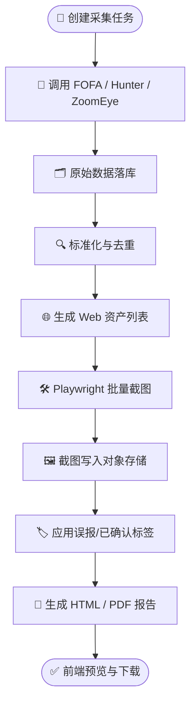

# 📋 AssetMap 本地总结报告

- 📊 报告类型：技术方案总结
- 🏷️ 分类标签：AssetMap 方案总结 前后端分离 截图报告
- 🔴 优先级：P1
- 👤 作者：Claude
- 🕐 日期：2026-04-12
- 📌 状态：✅ 已完成
- 📝 版本：v1.1

## 📊 摘要

本报告用于汇总 AssetMap 项目的核心方案结论，便于在本地以 Markdown 形式沉淀和后续扩展。方案核心是以 FOFA、鹰图、ZoomEye 为资产采集入口，以 Playwright 为批量截图验证引擎，以报告模块作为最终交付出口，并通过误报/已确认标签与选择集能力支撑筛选、复用和报告过滤。整体建议采用前后端分离、后端异步任务驱动、数据库与对象存储结合的系统形态。

---

## 🔄 1. 总体方案流程

---

## 📂 2. 核心结论

### 2.1 系统目标

AssetMap 项目目标如下：

1. 从 **FOFA / 鹰图 / ZoomEye** 获取资产数据。
2. 对获取到的 Web 资产做 **Playwright 批量截图验证**。
3. 将截图批量写入报告。
4. 系统采用 **前后端分离架构**。
5. 支持用户将网站标记为 **误报** 或 **已确认**，并控制其不进入报告。
6. 支持 **列表选择 / 保存选择集**，便于后续截图和报告复用。

### 2.2 推荐技术路线

| 模块 | 推荐方案 | 说明 |
|---|---|---|
| 前端 | Vue 3 / React | 用于列表、报告、任务和配置管理 |
| 后端 | FastAPI | 负责 API、任务编排、权限和查询 |
| 异步任务 | Celery + Redis | 处理采集、截图、报告生成 |
| 数据库 | PostgreSQL | 保存任务、资产、标签、报告元数据 |
| 文件存储 | MinIO / S3 | 存放截图和报告文件 |
| 截图引擎 | Playwright | 批量访问目标并截图 |

---

## 🔍 3. 原型复用总结

### 3.1 当前本地已有文件

当前目录下已存在以下关键文件：

- `AssetMap 项目方案文档.md`
- `AssetMap.zip`
- `web_screenshot_xlsx.py`
- `gui.py`
- `test_web_screenshot_xlsx.py`
- `screenshots/`
- `results/`

### 3.2 可直接复用的原型能力

现有原型已具备以下基础：

1. Excel 读取资产数据。
2. 自动生成候选 URL。
3. Playwright 并发截图。
4. 截图结果输出 CSV。
5. 失败原因分类。
6. 本地 GUI 启动截图任务。

### 3.3 正式项目中的处理建议

- 保留 `web_screenshot_xlsx.py` 中的核心截图逻辑。
- 不再以 `gui.py` 作为正式产品入口。
- 将现有脚本能力迁移为后端 Worker 服务。
- 将 `screenshots/`、`results/` 从本地目录模式升级为对象存储 + 数据库存元数据模式。

---

## 🏗️ 4. 架构与数据设计总结

### 4.1 架构模式

推荐采用：

- **前后端分离**
- **后端异步任务**
- **数据库 + 对象存储**
- **标签驱动的报告过滤**

### 4.2 核心模块划分

| 模块 | 职责 |
|---|---|
| 数据采集模块 | 接入 FOFA / Hunter / ZoomEye |
| 数据标准化模块 | 字段统一、去重、资产建模 |
| 截图模块 | 调用 Playwright 批量截图 |
| 报告模块 | 生成 HTML / PDF 报告 |
| 标签模块 | 管理误报 / 已确认标签 |
| 选择集模块 | 保存资产选择结果用于复用 |

### 4.3 统一资产模型

建议统一分为三层：

1. **Host**：IP、ASN、ISP、地理信息。
2. **Service**：端口、协议、banner、产品信息。
3. **WebEndpoint**：URL、域名、标题、状态码、截图状态。

### 4.4 关键数据表

| 表名 | 作用 |
|---|---|
| `collect_jobs` | 采集任务 |
| `source_observations` | 原始响应留存 |
| `hosts` | 主机数据 |
| `services` | 服务数据 |
| `web_endpoints` | Web 资产数据 |
| `screenshots` | 截图元数据 |
| `reports` | 报告记录 |
| `labels` | 标签数据 |
| `label_audit_logs` | 标签审计 |
| `saved_selections` | 选择集定义 |
| `selection_items` | 选择集内容 |

---

## 🛠️ 5. 核心功能总结

### 5.1 数据采集

- 支持 FOFA / Hunter / ZoomEye 多源采集。
- 支持查询语句、分页、时间范围和限速控制。
- 原始数据必须落库，方便审计和追溯。

### 5.2 批量截图

- 从标准化后的 Web 资产生成截图任务。
- Playwright 负责批量访问和截图。
- 截图结果写入对象存储。
- 截图状态回写数据库。

### 5.3 报告生成

- 支持 HTML 报告。
- 支持 PDF 导出。
- 报告引用截图缩略图和原图。
- 报告生成时应用标签过滤规则。

### 5.4 标签过滤

支持两类标签：

- `false_positive`：误报
- `confirmed`：已确认

报告默认建议：

- 排除误报。
- 已确认是否排除做成可配置。

如果业务上需要“误报和已确认都不写入报告”，可在正式实现时设为默认规则。

### 5.5 选择集功能

支持两种选择方式：

1. 临时多选。
2. 保存为选择集。

选择集可用于：

- 批量截图
- 批量生成报告
- 批量导出

---

## ⚠️ 6. 风险与注意事项

### 6.1 数据源风险

- 三方 API 配额限制不同。
- 字段权限可能与账号等级有关。
- 分页逻辑和返回字段存在平台差异。

### 6.2 截图风险

- 目标站点可能超时、证书异常或 DNS 失败。
- 部分页面可能存在登录限制、反爬或验证码。
- 批量截图需控制并发，避免对目标造成压力。

### 6.3 报告风险

- 截图失败不应阻塞整体报告生成。
- 图片不宜写数据库，应使用对象存储。
- 标签过滤规则必须清晰，避免误删报告内容。

---

## 💡 7. 后续建议

### 7.1 实施顺序建议

1. 先做数据采集与统一模型。
2. 再做截图服务化。
3. 再做标签与报告模块。
4. 最后做前端完整页面与管理能力。

### 7.2 产品化建议

- 优先保留你现有的截图原型逻辑，减少重复开发。
- 以资产列表页作为核心操作入口。
- 以选择集作为截图和报告复用的关键能力。
- 以标签作为报告过滤的核心控制机制。

---

## ✅ 8. 结论

AssetMap 的最佳建设方向，是将现有“本地 Excel + Playwright 截图原型”升级为一个**前后端分离、异步任务驱动、支持多数据源采集和报告输出的平台型系统**。系统以 FOFA、鹰图、ZoomEye 为采集入口，以 Playwright 为截图验证引擎，以标签与选择集能力支撑批量筛选和报告过滤，最终形成统一、可审计、可复用的资产交付闭环。

---

## 📎 9. 附录

### 9.1 当前参考文件

- `AssetMap 项目方案文档.md`
- `AssetMap.zip`
- `web_screenshot_xlsx.py`
- `gui.py`
- `test_web_screenshot_xlsx.py`
- `screenshots/`
- `results/`

### 9.2 推荐后续补充文档

- 数据库表结构详细说明
- API 接口详细说明
- Mermaid 架构图与流程图
- 前端页面原型说明
- 项目排期与里程碑说明
