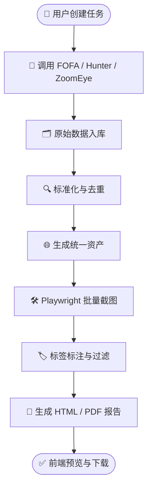

# 📋 AssetMap 系统设计说明书

- 📊 报告类型：技术方案
- 🏷️ 分类标签：AssetMap 系统设计 前后端分离 资产测绘
- 🔴 优先级：P1
- 👤 作者：Claude
- 🕐 日期：2026-04-12
- 📌 状态：✅ 已完成
- 📝 版本：v1.0

## 📊 摘要

本说明书用于定义 AssetMap 的系统建设目标、总体架构、模块划分、业务流程与非功能要求。系统面向资产暴露面梳理、批量截图验证和报告交付场景，核心能力包括多数据源采集、统一资产建模、标签过滤和选择集复用。整体建议采用前后端分离、后端异步任务驱动、数据库与对象存储结合的技术架构。

---

## 🔄 1. 系统总体流程

---

## 📂 2. 项目概述

### 2.1 项目名称

AssetMap

### 2.2 项目背景

AssetMap 用于对外部暴露资产进行集中采集、标准化、截图验证和报告输出。系统通过接入 FOFA、鹰图、ZoomEye 三类网络空间测绘平台，统一获取资产数据，并对可访问的 Web 目标进行 Playwright 批量截图，最终生成结构化报告。

### 2.3 项目目标

1. 从 FOFA、鹰图、ZoomEye 获取资产数据。
2. 对采集到的 Web 资产进行 Playwright 批量截图验证。
3. 将截图批量写入报告。
4. 采用前后端分离架构建设系统。
5. 支持用户将网站标记为误报或已确认，并控制其不写入报告。
6. 提供列表选择与保存选择集能力。
7. 形成可扩展、可审计、可复用的资产采集与报告平台。

### 2.4 适用场景

- 互联网暴露面梳理
- 周期性资产核查
- 风险资产截图留痕
- 对外资产台账生成
- 安全报告交付

---

## 🏗️ 3. 系统总体架构

### 3.1 架构原则

系统采用以下设计原则：

- 前后端分离
- 模块职责清晰
- 异步任务驱动
- 数据可追溯
- 报告可重复生成
- 标签过滤可配置
- 支持后续扩展更多数据源

### 3.2 总体架构说明

系统整体分为四层：

1. **前端展示层**：提供任务创建、资产列表、截图管理、报告中心、标签管理、选择集管理等功能。
2. **后端控制层**：提供统一 API、认证授权、任务编排、筛选查询、标签控制、报告触发等功能。
3. **异步执行层**：负责批量采集、批量截图、报告生成等耗时任务。
4. **数据存储层**：保存资产数据、原始返回、截图元数据、标签、选择集、报告记录等内容。

### 3.3 技术建议

| 层级 | 推荐方案 | 说明 |
|---|---|---|
| 前端 | Vue 3 + Element Plus / React + Ant Design | 页面展示与交互 |
| 后端 | FastAPI | API、权限、任务编排 |
| 队列 | Celery + Redis | 采集、截图、报告异步执行 |
| 数据库 | PostgreSQL | 资产与业务数据存储 |
| 文件存储 | MinIO / S3 | 截图、报告文件存储 |
| 截图引擎 | Playwright | 页面访问与截图 |

---

## 📂 4. 功能模块设计

### 4.1 数据采集模块

负责接入 FOFA、鹰图、ZoomEye，执行资产查询和原始数据采集。

核心能力：
- 支持多数据源单独或组合采集
- 支持分页抓取
- 支持配额感知
- 支持失败重试
- 支持原始数据留存

### 4.2 数据标准化模块

负责将不同数据源返回的数据统一映射到 AssetMap 内部资产模型。

统一模型：
- Host
- Service
- WebEndpoint

核心能力：
- 字段映射
- URL 规范化
- 去重
- 多源合并
- 时间戳对齐

### 4.3 批量截图模块

负责对 Web 资产进行批量截图，用于后续验证与报告展示。

核心能力：
- 支持并发截图
- 支持候选 URL 自动拼接
- 支持截图失败分类
- 支持跳过已存在截图
- 支持截图状态回写数据库

### 4.4 报告生成模块

负责根据资产与截图数据生成 HTML / PDF 报告。

核心能力：
- 支持批量引用截图
- 支持标签过滤
- 支持按选择集生成报告
- 支持按筛选条件生成报告
- 支持下载与归档

### 4.5 标签管理模块

支持用户将站点标记为误报或已确认，并影响报告生成结果。

标签类型：
- false_positive
- confirmed

核心能力：
- 单条标记
- 批量标记
- 标签审计
- 标签回滚
- 报告过滤规则配置

### 4.6 选择集管理模块

允许用户保存筛选结果或静态资产列表，便于后续重复截图和报告生成。

核心能力：
- 保存动态筛选
- 保存静态列表
- 基于选择集截图
- 基于选择集出报告

---

## 🔄 5. 业务流程设计

### 5.1 采集流程

1. 用户创建采集任务。
2. 选择数据源和查询条件。
3. 后端创建采集任务记录。
4. 异步 Worker 执行调用。
5. 原始数据落库。
6. 进入标准化与去重。
7. 生成统一资产清单。

### 5.2 截图流程

1. 用户在资产列表中选择目标。
2. 创建截图任务。
3. Screenshot Worker 执行批量截图。
4. 上传截图到对象存储。
5. 回写截图元数据与状态。

### 5.3 报告流程

1. 用户选择范围或选择集。
2. 系统读取资产与截图。
3. 应用误报 / 已确认过滤规则。
4. 生成 HTML 报告。
5. 按需导出 PDF。
6. 保存报告记录。

### 5.4 标签流程

1. 用户选择资产。
2. 标记为误报或已确认。
3. 生成审计日志。
4. 标签在后续报告中生效。
5. 必要时可按批次回滚。

---

## ⚙️ 6. 前端页面设计

### 6.1 仪表盘
- 采集任务统计
- 数据源配额信息
- 资产总量
- 截图成功率
- 报告生成情况

### 6.2 采集任务页
- 选择数据源
- 输入查询条件
- 设置筛选参数
- 提交采集任务
- 查看任务状态

### 6.3 资产列表页
- 资产筛选
- 多选
- 批量截图
- 批量标记
- 加入选择集
- 导出

### 6.4 资产详情页
- 资产基本信息
- 来源原始数据
- 截图记录
- 标签记录
- 报告引用记录

### 6.5 选择集页
- 查看所有选择集
- 编辑选择集
- 删除选择集
- 基于选择集截图
- 基于选择集生成报告

### 6.6 报告中心
- 查看报告列表
- 创建报告
- 预览 HTML
- 下载 PDF

### 6.7 系统配置页
- 配置 FOFA / Hunter / ZoomEye 密钥
- 设置截图参数
- 设置过滤规则
- 设置并发与限速

---

## 🔐 7. 安全与审计设计

### 7.1 密钥管理

- 所有第三方 API Key 仅在后端保存。
- 前端不直接接触密钥。
- 密钥应加密存储。

### 7.2 权限控制

建议角色：
- Viewer：只读
- Analyst：可采集、截图、报告
- Auditor：可标记误报、已确认、回滚
- Admin：可配置系统参数和密钥

### 7.3 审计要求

以下操作必须记录日志：
- 创建采集任务
- 批量截图
- 生成报告
- 下载报告
- 标记误报 / 已确认
- 回滚标签

---

## ⚠️ 8. 非功能要求

### 8.1 可扩展性
支持后续增加 Quake、Shodan 等数据源。

### 8.2 幂等性
- 重复截图可复用已有结果
- 重复报告可识别相同输入范围
- 标签写入采用幂等更新

### 8.3 稳定性
- 任务失败支持重试
- 错误分类明确
- 报告生成不因个别截图失败而整体中断

### 8.4 可运维性
- 采集量监控
- 截图成功率监控
- 队列积压监控
- 存储空间监控
- API 配额监控

---

## 💡 9. 分阶段实施建议

### 9.1 第一阶段
- 数据源接入
- 统一资产模型
- 原始数据存储
- 去重

### 9.2 第二阶段
- Playwright 截图服务化
- 对象存储
- 截图状态管理

### 9.3 第三阶段
- 标签管理
- HTML / PDF 报告生成
- 报告过滤规则

### 9.4 第四阶段
- 前端页面完善
- 选择集功能
- 审计与运维增强

---

## ✅ 10. 结论

AssetMap 应建设为一个面向资产测绘结果管理、截图验证和报告交付的前后端分离平台。系统以 FOFA、鹰图、ZoomEye 为资产来源，以 Playwright 为截图引擎，以标签与选择集为用户控制手段，以 HTML / PDF 报告为最终输出，实现采集、验证、过滤、交付的一体化闭环。

---

## 📎 11. 附录

### 11.1 参考文件
- `AssetMap 项目方案文档.md`
- `AssetMap.zip`
- `web_screenshot_xlsx.py`
- `gui.py`
- `test_web_screenshot_xlsx.py`

### 11.2 推荐后续补充文档
- 数据库表结构详细说明
- API 接口详细说明
- Mermaid 架构图与流程图
- 前端页面原型说明
- 项目排期与里程碑说明
