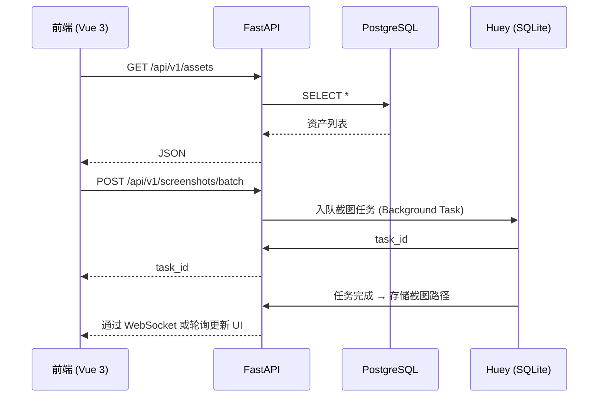

# 项目详细分析报告

---

## 📚 项目概览
- **项目名称**：AssetMap
- **主要功能**：面向资产测绘结果管理、批量截图验证和报告输出的平台。
- **技术栈**：
  - 后端：Python (FastAPI)
  - 前端：Vue 3 + Element Plus + Pinia + Vite
  - 数据库：PostgreSQL (主数据库) + SQLite (Huey 任务队列)
  - 任务队列：Huey (当前) / Celery (规划中)
- **部署方式**：本地开发环境 / 容器化规划中
- **代码组织**：`backend/`, `frontend/`, `docs/`, `archive/` 模块化目录

---

## 📂 目录结构概览
```
AssetMap/
├─ backend/                  # 后端代码目录
│   ├─ app/                 # FastAPI 应用核心逻辑
│   │   ├─ api/             # API 路由定义 (v1)
│   │   ├─ core/            # 核心配置与中间件
│   │   ├─ models/          # SQLAlchemy 数据模型
│   │   ├─ schemas/         # Pydantic 数据验证模型
│   │   ├─ services/        # 业务逻辑服务层 (Playwright 截图等)
│   │   └─ tasks/           # Huey 异步任务定义
│   ├─ init_db.py           # 数据库初始化脚本
│   ├─ requirements.txt     # 后端依赖清单
│   └─ .env.example         # 环境变量配置模板
├─ frontend/                 # 前端 Vue 3 工程目录
│   ├─ src/                 # 前端源代码
│   ├─ package.json         # 前端依赖配置
│   └─ vite.config.ts       # Vite 构建配置
├─ docs/                     # 归档的设计文档与方案
├─ report/                   # 报告输出目录
├─ main.py                   # 根目录启动脚本
└─ 360鹰图导入.csv           # 示例导入数据
```

---

## 🛠️ 后端分析
### 关键技术
- **框架**：FastAPI - 提供高性能的异步 Web 服务。
- **ORM**：SQLAlchemy 2.0 - 采用 2.0 风格的异步数据库交互。
- **验证**：Pydantic v2 - 严格的数据校验与模式定义。
- **异步任务**：Huey - 轻量级任务队列，用于处理 Playwright 截图等耗时操作。
- **截图服务**：Playwright - 用于资产的批量网页截图验证。

### 关键目录结构
- `backend/app/api/`：遵循 RESTful 风格的 API 路由。
- `backend/app/models/`：定义了核心资产模型（Hosts, Services, WebEndpoints 等）。
- `backend/app/services/`：封装了截图逻辑、FOFA/Hunter 接口适配。
- `backend/app/tasks/`：集成了 Huey 的异步任务处理逻辑。

### 运行环境
- 使用 `psycopg` 连接 PostgreSQL 数据库。
- 支持环境变量配置（`.env`）。
- 已内置数据库初始化脚本 `init_db.py`。

---

## 🎨 前端分析
### 技术栈
- **核心框架**：Vue 3 (Composition API)
- **构建工具**：Vite - 提供极速的开发体验。
- **UI 组件库**：Element Plus - 现代化的 Vue 3 UI 框架。
- **状态管理**：Pinia - 轻量且直观的全局状态管理。
- **图表库**：ECharts + vue-echarts - 用于仪表盘数据可视化。
- **HTTP 客户端**：Axios - 封装了基础 API 请求。

### 功能模块
- **Dashboard**：资产统计仪表盘。
- **Job Management**：测绘任务下发与状态追踪。
- **Asset List**：支持高级筛选与批量操作的资产视图。
- **Selection Set**：资产灵活分组与收藏。
- **Report Center**：报告生成任务管理。

---

## 📊 数据与依赖
| 数据文件 | 大小 | 用途 |
|----------|------|------|
| `360鹰图导入.csv` | 3 KB | 示例 CSV 导入数据（资产信息） |
| `huey_db.sqlite3` | 28 KB | Huey 任务队列持久化 |
| `huey_db.sqlite3` (备份) | - | 可能的备份文件 |

- 主数据库使用 PostgreSQL，适合生产级大规模资产管理；Huey 任务队列当前使用 SQLite 进行持久化。

---

## ⚡ 性能评估（基于现有信息）
| 项目 | 潜在瓶颈 | 建议优化 |
|------|----------|----------|
| 启动时间 | Python 解释器启动 + FastAPI 加载 | 使用 `uvicorn` 多进程部署；开启 lazy‑load。
| 数据查询 | 复杂联表查询性能 | 优化数据库索引；使用 SQLAlchemy 异步查询。
| 异步任务 | Huey 基于 SQLite 受限并发 | 替换为 Redis + Celery 以提高吞吐量。
| 前端渲染 | 大量资产数据列表渲染 | 开启虚拟滚动、代码分割，优化 Pinia 状态树。

---

## 🛡️ 风险清单 & 缓解措施
| 风险 | 影响 | 缓解措施 |
|------|------|----------|
| **API 接入延迟**：FOFA/Hunter 等真实数据源尚未完全接通 | 目前仅依赖 Sample 模式，无法处理实时资产测绘 | 加快 `services/` 中对应 API 适配器的开发与测试。 |
| **异步队列性能**：Huey 默认使用 SQLite | 处理超大规模截图任务时可能存在并发瓶颈 | 规划迁移至 Redis 驱动的 Celery 异步任务系统。 |
| **报告生成尚未实现**：HTML/PDF 导出仍为空白 | 核心交付物（报告）无法直接输出 | 引入集成截图与 Jinja2 模板的报告生成引擎。 |
| **安全审计风险**：缺乏完善的鉴权机制 | 资产敏感数据可能面临未授权访问风险 | 引入 FastAPI Users 或基于 JWT 的认证系统。 |
| **部署一致性**：暂无 Docker 配置 | 环境迁移与本地开发环境同步困难 | 编写 `Dockerfile` 与 `docker-compose.yml` 统一运行环境。 |

---

## 📈 推荐路线图
1. **基础加固**：增加后端 `.env.example` 并切换数据库配置到环境变量模式。
2. **连接验证**：确保本地 PostgreSQL 连接稳定，并使用 `init_db.py` 刷新结构。
3. **数据打通**：接入真实的 FOFA / Hunter / ZoomEye API，打通端到端测绘流程。
4. **报告输出**：实现 HTML / PDF 报告真实生成逻辑。
5. **权限控制**：实现前端登录页、权限校验与后端接口保护。
6. **架构升级**：引入 Redis，将任务系统升级为 Celery 以支持更大并发。
7. **容器化部署**：完成 Docker 镜像构建，实现一键部署交付。

---

## 📂 附件

### 📊 API 调用序列图

- 项目根目录结构（已展示）
- 关键文件路径列表（`backend/requirements.txt`, `backend/init_db.py`, `README.md` 等）

---

> **结论**：
> - 项目已基于 **FastAPI** 和 **Vue 3** 构建了稳固的现代化基础，并集成了 **PostgreSQL** 和 **Huey** 处理核心业务与异步任务。
> - 当前处于第一阶段骨架版，已具备资产导入、截图验证与基础管理功能。
> - 后续工作应重点聚焦于 **真实 API 接入**、**报告生成逻辑** 以及 **权限安全加固**，以实现从原型到生产级平台的跃迁。

*本报告已保存至 `c:\Users\Administrator\VScode\AssetMap\report\project_analysis_report.md`*。
